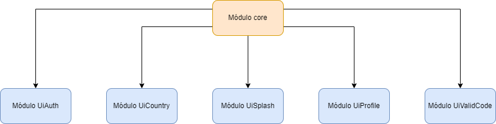
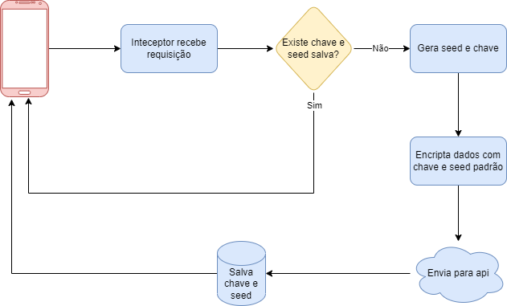
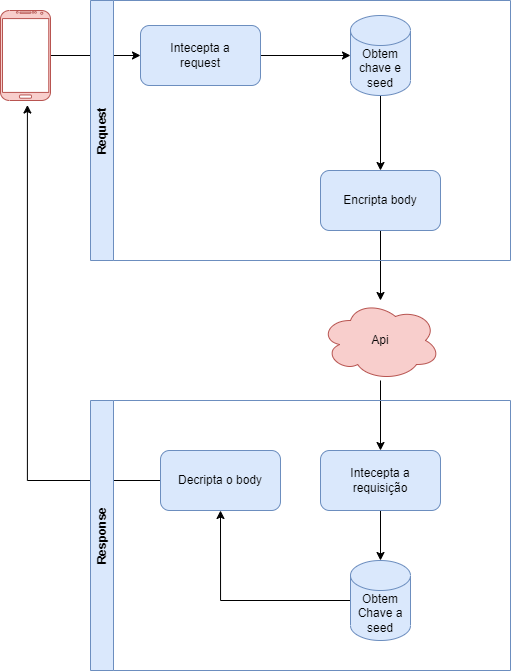

  
    

  

Projeto de portfólio para o envio de mensagens
  

  

 
 

## Descrição
Bem-vindo ao meu aplicativo de mensagens! Aqui você poderá enviar e receber mensagens de forma rápida e fácil. Desfrute de uma experiência de comunicação simples e eficiente em um único aplicativo. Fique conectado(a) e compartilhe suas mensagens de maneira conveniente com este app intuitivo e amigável.

  
    

 

## Dependência entre módulos

  
    

  

## Estrutura do projeto
Aqui vamos ver a estrutura das requisições para api.

### Registro e geração da chave e seed
Para realizar a comunicação com a api é necessario envio da chave e seed

  
    

  

### Inteceptor body
Após realizar o registro da chave, todas as requisições devem encryptar o body antes do envio para a api e seed enviado no header. O mesmo ocorre ao receber a resposta da api, vem encriptado pela api e o interceptor e resposável por decriptar a informação e passar para requisição.

  
    

  

## Tecnologias utilizadas
O app foi desenvolvido usando as seguintes tecnologias:
- Retrofit
- SharedPreference
- Equatable
- Bloc
- GetIt
- AutoRouter
- Flutter_test
- Mockito
- Bloc_test
- HttpMockAdapter

## Autor
- Author - [Raphael Maracaipe](https://www.linkedin.com/in/raphaelmaracaipe)
