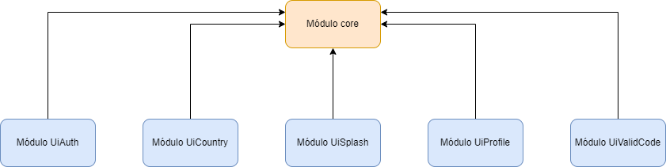

  

  
Projeto de portfólio para o envio de mensagens

## Descrição
Bem-vindo ao meu aplicativo de mensagens! Aqui você poderá enviar e receber mensagens de forma rápida e fácil. Desfrute de uma experiência de comunicação simples e eficiente em um único aplicativo. Fique conectado(a) e compartilhe suas mensagens de maneira conveniente com este app intuitivo e amigável.

## Dependência entre módulos

  

## Estrutura do projeto
- [Verificação e registro da chave](./docs/register_generate.md) - Realiza o registro e geração da chave para encriptar o decriptar a comunicação entre a api e mobile.
- [Inteceptor body](./docs/inteceptor_body.md) - É necessário realizar o encrypt e decrypt do body de todas as requisições para api.

## Autor
- Author - [Raphael Maracaipe](https://www.linkedin.com/in/raphaelmaracaipe)
